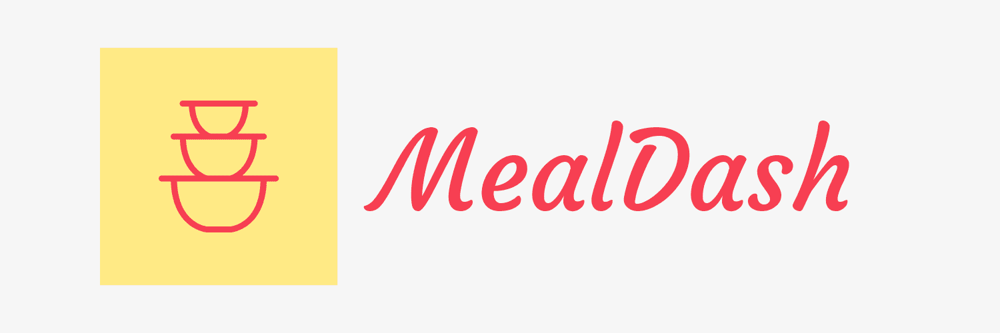

<a name="readme-top"></a>

<!-- PROJECT LOGO -->
<br />
<div align="center">
  <a href="https://github.com/azeez-ahmad/meal-dash">
    
  </a>
  <h3 align="center">Source code for Meal Dash</h3>
</div>

## About the project

With our application we want to create a platform that offers tiffin/meal prep plans that are healthy and delivered to the doorstep of our customers. Customers would be able to select from a wide range of meal plans and subscribe to them. Food service vendors can advertise their meal plans that are composed of multiple containerized and portioned meals which are delivered on a weekly basis to their customers. :tada::confetti_ball::balloon::balloon:

### Built With

This section lists the major frameworks/libraries used to bootstrap the project.

         

<!-- TABLE OF CONTENTS -->
<details>
  <summary>Table of Contents</summary>
  
  <ol>
    <li>
      <a href="#about-the-project">About The Project</a>
      <ul>
        <li><a href="#built-with">Built With</a></li>
      </ul>
    </li>
    <li>
      <a href="#getting-started">Getting Started</a>
      <ul>
        <li><a href="#prerequisites">Prerequisites</a></li>
        <li><a href="#setup(local)">Setup(local)</a></li>        
        <ul>
          <li><a href="#backend-service">Backend service</a></li>
        </ul>
      </ul>
    </li>
  </ol>
</details>

## Getting started

### Prerequisites

This is an example of how to list things you need to use the software and how to install them.
* npm
  ```sh
  npm install npm@latest -g
  ```
  
### Setup(local)

#### With Docker Compose
From root run following commands in sequence:
1. `docker-compose up -d mysql-master`
2. `docker-compose up -d server`

#### Without Docker Compose
Commands:
1. Go into app folder run `npm install`
2. Open two terminals, run node server on one terminal and run typescript compiler on the other.
3. Command to compile Ts code to JS `npm run compile`
4. Command to run node server `npm run nodemon	`
5. Swagger UI `http://localhost:3000/api-docs/#/`

- Sample .env
```
meal-dash-business/.env.development.local
meal-dash-business/.env.production.local
meal-dash-business/.env.development.local
meal-dash-business/.env.test.local
```

- PORT `PORT = 3000`

- DATABASE
```
DB_HOST = localhost
DB_PORT = 3306
DB_USER = YOUR_USER
DB_PASSWORD = YOUR_USER
DB_DATABASE = meal-dash
```

- TOKEN `SECRET_KEY = secretKey`

- LOG
```
LOG_FORMAT = dev
LOG_DIR = ../../../logs
```

- CORS
```
ORIGIN = *
CREDENTIALS = true
```

<p align="right">(<a href="#readme-top">back to top</a>)</p>
